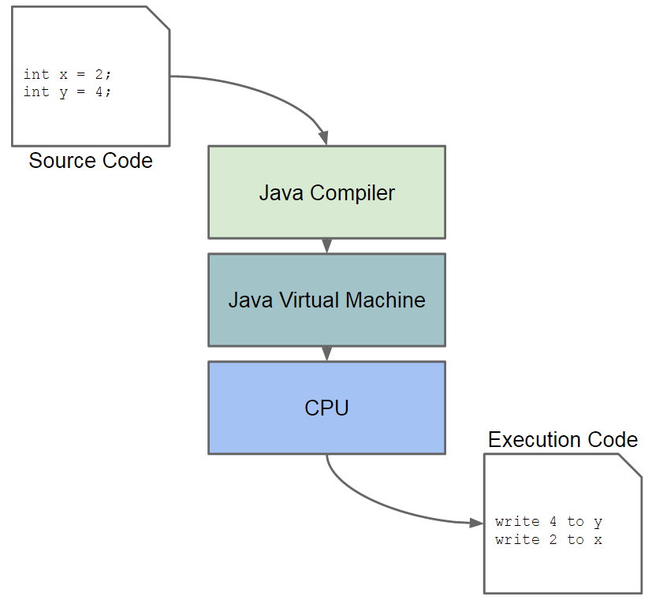

The Singleton ([Wiki](http://en.wikipedia.org/wiki/Singleton_pattern)) pattern is quite an old and well known pattern.  This pattern was discussed over and over again in many books and articles on the web.  So why are we discussing it again here?  This article is not about the Singleton pattern per se, but more about the Java Memory Model ([Paper](http://rsim.cs.illinois.edu/Pubs/popl05.pdf)) and the concurrent access of shared objects.

All code listed below is available at: [https://github.com/javacreed/the-broken-singleton](https://github.com/javacreed/the-broken-singleton).  Most of the examples will not contain the whole code and may omit fragments which are not relevant to the example being discussed. The readers can download or view all code from the above link.

This article provides a very brief introduction to the Java Memory Model and describes what kind of transformations can be applied to the code before this is executed by the CPU.  Then this article introduces the Singleton pattern and shows a common idiom using with the Singleton pattern, known as the _double-checked locking idiom_ ([Wiki](http://en.wikipedia.org/wiki/Double-checked_locking)).  Finally it provides a better approach, using the _lazy initialisation holder class idiom_ ([Wiki](http://en.wikipedia.org/wiki/Initialization-on-demand_holder_idiom)), and describes how the new approach does not suffer from the problems the double-checked locking idiom does.

## The Memory Model

Java, unlike other programming languages, has a well defined memory model which describes how memory related operations, such as allocation of memory, reading from memory and writing to memory, to name a few, are executed from a programmer perspective.  This model also defines what transformation (or optimisations) can be applied in order to improve the execution time, thus making the program executing faster.  Such transformation will not change the logic of the program.  For example, consider the following code fragment:

```java
int x = 2;
int y = 4;
int z = x + y;
```

The order in which the variables `x` and `y` are declared is irrelevant, but these two must be declared before variable `z`.  The Java Memory Model allows that variable  `y` is created before variable `x`, but variable `z` must be created after `x` and `y` are created.

The transformations can happen at three different stages as shown next.



Each stage can transform the code as they see fit, always adhering to the constraints set by the Java Memory Model.  Most of the unpredictable transformation are made by the CPU (the lowest level), which is very good at reordering code such that it minimises the inefficiencies and maximising the performance of a program.  We will only introduce the Java Memory Model in this article as this is quite comprehensive and others, such as the [paper](http://rsim.cs.illinois.edu/Pubs/popl05.pdf) by Jeremy Manson, William Pugh and Sarita V. Adve, already did.

The aim of this article is to highlight the impact of such transformations have on the Java code, using the Singleton pattern as an example.  In the source code shown in the above figure, we have two variables declarations, where the variable `x` is declared before variable `y`.  This order is known as the program order.  The applied transformations may end up such that the variable `y` is created and assigned before variable `x`.

While this has little, if any, impact to single threaded programs, such transformations have a great impact on multithreaded programs.  In fact the Java Memory Model is always discussed within a multithreaded context.  To make things worse, simple operations, such as creating a new instance of an object, may result in a number of CPU instructions.

|Source Code               |CPU Instructions |
|--------------------------|-----------------|
|`Object x = new Object();`|Allocate space for new object<br />Store the unconstructed object in variable<br />Initialise object|

In the above table we saw how one single line of code translates to several lines of CPU instructions.  **Please note that the above CPU instructions may be incorrect and these are there just for illustration purposes**.

This section briefly introduced the Java Memory Model and provided two simple examples of what can happen to the code when this is executed by the CPU.  In the next section we will see how such transformation affect our programs when used within multithreaded environments.

## The Singleton

The Singleton is a design pattern where, at most, only one instance of a given object is created.  In other words, this design pattern restricts the number of instances created of a certain class to one.  This is quite useful when you need to coordinate things through a single service.  Say we have a sequence generator (such as an ID generator), and this sequence generator is used by several other classes throughout the application to generate unique values, similar to an auto-increment column in a database table.  It is imperative that the created values are unique as otherwise we may have duplicate ids and compromise the application integrity.

```java
package com.javacreed.examples.concurrency.part1;

public class SequenceGenerator {

  private long nextValue;

  public SequenceGenerator(final long nextValue) {
    this.nextValue = nextValue;
  }

  public synchronized long getNextValue() {
    return nextValue++;
  }

}
```

The above example, shows a simple implementation of a sequence generator.  The sequence generator shown above is thread-safe and it is guaranteed not to generate duplicates even when accessed by multiple threads.  The uniqueness is bound to a single instance as the same instance is used as an intrinsic lock.

```java
  public synchronized long getNextValue() {
    return nextValue++;
  }
```

With that said, two instances of this class will definitely produce duplicate values as shown next.

```java
package com.javacreed.examples.concurrency.part1;

public class Example1 {

  public static void main(String[] args) {
    SequenceGenerator a = new SequenceGenerator(1L);
    System.out.printf("SG A: %d%n", a.getNextValue());
    System.out.printf("SG A: %d%n", a.getNextValue());

    SequenceGenerator b = new SequenceGenerator(1L);
    System.out.printf("SG B: %d%n", b.getNextValue());
  }
}
```

In the above example, we have two instances of the same sequence generator.  The second instance produces the same values as the first one.  Therefore if we want to generate unique values, we cannot have two instances of this class.

```
SG A: 1
SG A: 2
SG B: 1
```

The only way to address this problem is to make this class a Singleton.  Following is one way of how to make this class a (**lazy**) Singleton.

```java
package com.javacreed.examples.concurrency.part2;

public class SequenceGenerator {

  public static synchronized SequenceGenerator getInstance() {
    if (SequenceGenerator.INSTANCE == null) {
      SequenceGenerator.INSTANCE = new SequenceGenerator(1L);
    }
    return SequenceGenerator.INSTANCE;
  }

  private long nextValue;

  private static SequenceGenerator INSTANCE;

  private SequenceGenerator(final long nextValue) {
    this.nextValue = nextValue;
  }

  public synchronized long getNextValue() {
    return nextValue++;
  }
}
```

The constructor was changed to `private`, so that no other class has visibility to this constructor and thus this class cannot be instantiated from another class.  A new static method was added, named `getInstance()`, which returns the only instance of this class.  This approach makes use of lazy initialisation, that is, the Singleton is only created when this is accessed for the first time.  

The `getInstance()` method is synchronized, using the same class as its intrinsic lock.  Some developers wanted to minimise the synchronisation to cover only the creation of the Singleton and proposed the double-checked locking idiom. The following example shows what many believed to be a correct improvement to the simple implementation shown above.

```java
package com.javacreed.examples.concurrency.part2;

public class BrokenSequenceGenerator {

  public static BrokenSequenceGenerator getInstance() {
    if (BrokenSequenceGenerator.INSTANCE == null) {
      synchronized (BrokenSequenceGenerator.class) {
        if (BrokenSequenceGenerator.INSTANCE == null) {
          BrokenSequenceGenerator.INSTANCE = new BrokenSequenceGenerator(1L);
        }
      }
    }
    return BrokenSequenceGenerator.INSTANCE;
  }

  /* Rest of the class removed for brevity */
}
```

The above implementation makes use of the double-checked locking idiom.  This implementation will only create one instance of this class, even when used with multiple threads.  In order to verify this approach we tested this implementation to make sure that only one instance is ever created and that all generated values from all threads are unique.

```java
package com.javacreed.examples.concurrency.part2;

import java.util.Collections;
import java.util.HashSet;
import java.util.IdentityHashMap;
import java.util.LinkedList;
import java.util.List;
import java.util.Set;
import java.util.concurrent.BrokenBarrierException;
import java.util.concurrent.CyclicBarrier;
import java.util.concurrent.atomic.AtomicReference;

import junit.framework.AssertionFailedError;

import org.junit.Assert;
import org.junit.Test;

public class BrokenSequenceGeneratorTest {

  @Test
  public void test() throws Throwable {

    final int size = 12;

    final CyclicBarrier cyclicBarrier = new CyclicBarrier(size);

    final AtomicReference<Throwable> exception = new AtomicReference<>();

    final Set<Long> generatedValues = new HashSet<>(size);

    final Set<BrokenSequenceGenerator> instances = Collections
        .newSetFromMap(new IdentityHashMap<BrokenSequenceGenerator, Boolean>());

    final List<Thread> threads = new LinkedList<>();
    for (int i = 0; i < size; i++) {
      final Thread thread = new Thread(new Runnable() {
        @Override
        public void run() {
          try {
            cyclicBarrier.await();
          } catch (InterruptedException | BrokenBarrierException e) {
            exception.compareAndSet(null, e);
            return;
          }

          final BrokenSequenceGenerator sequenceGenerator = BrokenSequenceGenerator.getInstance();
          final long value = sequenceGenerator.getNextValue();

          /* Synchronise the access as the collections used are not thread-safe */
          synchronized (BrokenSequenceGeneratorTest.class) {
            if (!generatedValues.add(value)) {
              exception.compareAndSet(null, new AssertionFailedError("Duplicate value " + value));
              return;
            }
            instances.add(sequenceGenerator);
          }
        }
      });
      thread.start();
      threads.add(thread);
    }

    for (final Thread thread : threads) {
      thread.join();
    }

    if (exception.get() != null) {
      throw exception.get();
    }

    switch (instances.size()) {
    case 0:
      Assert.fail("Expected one instance, but found none");
      break;
    case 1:
      break;
    default:
      Assert.fail("Expected one instance, but found many");
    }
  }
}
```

The above JUnit ([Homepage](http://junit.org/)) test creates twelve threads.  Each thread tries to get the instance of the `BrokenSequenceGenerator` at almost the same time, using a `CyclicBarrier` ([Java Doc](https://docs.oracle.com/javase/7/docs/api/java/util/concurrent/CyclicBarrier.html)) to control the execution timings of each thread.  The test verifies that only unique values are generated and that only one instance of the `BrokenSequenceGenerator` is created.

In this section we introduced the Singleton pattern and provided a simple example.  We then modified it using the double-checked locking idiom, an old and incorrect technique that limits the synchronisation required to improve performance.  In the next section we will analyse why this implementation is incorrect despite the fact that it passed the test with flying colours.

## The Problem

The problem that the double-checked locking idiom has is not related to the generated values or to the number of instances created.  Instead it is related to _partially initialised objects_.  Before we can understand this we need to understand how the Java Memory Model and the transformations applied affects our program when used with multiple threads.  The method is question is shown next.

```java
  public static BrokenSequenceGenerator getInstance() {
    if (BrokenSequenceGenerator.INSTANCE == null) {
      synchronized (BrokenSequenceGenerator.class) {
        if (BrokenSequenceGenerator.INSTANCE == null) {
          BrokenSequenceGenerator.INSTANCE = new BrokenSequenceGenerator(1L);
        }
      }
    }
    return BrokenSequenceGenerator.INSTANCE;
  }
```

This method has the following _program order_:

1. Checks if the instance is initialised or not (outside synchronized block)

    ```java
        if (BrokenSequenceGenerator.INSTANCE == null) {
        }
    ```

    The first check is made outside the synchronised block in order to avoid it when the instance is already     created.  In such cases, we simply return the created instance.

1. If the instance is not initialised, then enters the synchronised block using the class as a lock

    ```java
        if (BrokenSequenceGenerator.INSTANCE == null) {
          synchronized (BrokenSequenceGenerator.class) {
          }
        }
    ```

    Only one thread is allowed through the synchronised block at any give point in time.  This is sometimes referred to as the critical section ([Wiki](http://en.wikipedia.org/wiki/Critical_section)).

1. From within the synchronised block, make sure that the instance is still `null` just in case another thread beat this thread and initialised the sequence generator before.

    ```java
        if (BrokenSequenceGenerator.INSTANCE == null) {
          synchronized (BrokenSequenceGenerator.class) {
            if (BrokenSequenceGenerator.INSTANCE == null) {
            }
          }
        }
    ```

    This is from where this idiom took its name as we make two _IF_ checks.

1. Still within the synchronized block, create the instance and update the class field `INSTANCE` to point to this new object.

    ```java
        if (BrokenSequenceGenerator.INSTANCE == null) {
          synchronized (BrokenSequenceGenerator.class) {
            if (BrokenSequenceGenerator.INSTANCE == null) {
              BrokenSequenceGenerator.INSTANCE = new BrokenSequenceGenerator(1L);
            }
          }
        }
    ```

    Please note that as we saw before, this simple line comprise several CPU operations such as allocating memory to this object, initialising the object and its fields, updating the field `INSTANCE` with the address where this newly created object is, to name a few.

1. Finally, this method returns the single instance of this class.

    ```java
        return BrokenSequenceGenerator.INSTANCE;
    ```

The program order **may be** modified but such modifications will never alter the program logic.  In other words, the body of the _IF_ control statement will never be reordered such that it is executed before the _IF_ condition.  Furthermore, each execution line comprises several CPU operations, such as read from CPU registers (the local CPU memory and not main memory, also referred to as RAM), write to registers, transfer data between the registers and the main memory, compare data and operate on data to name a few.  Therefore what is seen as one single line of code is in fact a number of CPU operations.

The main issue with this implementation is here.  Say that _Thread-A_ is creating the instance of the sequence generator as shown next.

```java
  public static BrokenSequenceGenerator getInstance() {
    if (BrokenSequenceGenerator.INSTANCE == null) {
      synchronized (BrokenSequenceGenerator.class) {
        if (BrokenSequenceGenerator.INSTANCE == null) {
          BrokenSequenceGenerator.INSTANCE = new BrokenSequenceGenerator(1L);
        }
      }
    }
    return BrokenSequenceGenerator.INSTANCE;
  }
```

The CPU will execute the following three steps in the order shown next

1. Allocate memory to object
1. Set the `INSTANCE` field to point to the new object
1. Initialise the object (executes the constructor)

The `INSTANCE` field is set before the constructor is executed.  Therefore, when the field `INSTANCE` is set, the instance is not yet initialised.  This state is known as the partially initialised object, as the field `INSTANCE` is pointing to an object which is not yet ready.  While _Thread-A_ finishes execution step 2 (from the above list) and setting the `INSTANCE` field, a second thread, _Thread-B_ tries to get an instance of the sequence generator.  The first check made by _Thread-B_, highlighted in the next fragment, is made outside the synchronised block.  Therefore _Thread-B_ is allowed to proceed without having to wait for _Thread-A_ to finish.

```java
  public static BrokenSequenceGenerator getInstance() {
    if (BrokenSequenceGenerator.INSTANCE == null) {
      synchronized (BrokenSequenceGenerator.class) {
        if (BrokenSequenceGenerator.INSTANCE == null) {
          BrokenSequenceGenerator.INSTANCE = new BrokenSequenceGenerator(1L);
        }
      }
    }
    return BrokenSequenceGenerator.INSTANCE;
  }
```

Since, _Thread-A_ has already set the `INSTANCE` field, _Thread-B_ **may** find this set, thus the expression `BrokenSequenceGenerator.INSTANCE == null` will yield `false`, and proceeds by returning the instance.  Note that _Thread-A_ has not yet finished initialising the object and therefore, _Thread-B_ has access to an object which is partially initialised.

Note that in the above paragraph we emphasised on the word _may_.  Unfortunately, this is very indeterministic and while such problem can manifest itself on one platform, it may not on another platform.  Therefore, this problem is very hard to reproduce and replicate and to write tests that make it manifest every time the test runs.

In this section we discussed the double-checked locking idiom and saw how this technique can produce partially initialised objects.  In the following section we will see another approach which leverage the features available to Java programming language, to provide what seems to be a lock free implementation of a Singleton that makes use of lazy initialisation.

## A Safer Approach

The _lazy initialization holder class idiom_ ([Wiki](http://en.wikipedia.org/wiki/Initialization-on-demand_holder_idiom)) is a technique which leverage the class initialisation to provide lazy initialisation as defined in [section 12.4](http://docs.oracle.com/javase/specs/jls/se7/html/jls-12.html#jls-12.4) of the Java Language Specification.   

Consider the following example.

```java
package com.javacreed.examples.concurrency.part3;

public class SequenceGenerator {

  private static class SingletonHolder {
    private static final SequenceGenerator INSTANCE = new SequenceGenerator(1L);
  }

  public static SequenceGenerator getInstance() {
    return SingletonHolder.INSTANCE;
  }

  private long nextValue;

  private SequenceGenerator() {}

  private SequenceGenerator(final long nextValue) {
    this.nextValue = nextValue;
  }

  public synchronized long getNextValue() {
    return nextValue++;
  }
}
```

When the `SequenceGenerator` class is loaded by the Java Virtual Machine, this class is initialised.   The initialisation process happens only once, when the class is loaded for the first time by the Java Virtual Machine.  The static inner class `SingletonHolder` is not initialised when the container class, `SequenceGenerator` is initialised.  Therefore, only the `SequenceGenerator` is initialised.  When the method `getInstance()` is executed for the first time, the static inner class `SingletonHolder` is initialised for the first time too.  The initialisation process is thread safe and therefore we do not need to add further synchronization.  This is guaranteed by the Java Language Specification.  This approach solved our lazy initialisation problem without the need to use synchronisation.

Note that we removed the static field named `INSTANCE` from the `SequenceGenerator` class.  Furthermore, the method `getNextValue()` still needs to be synchronised as otherwise the instance of `SequenceGenerator` may produce duplicate values when used by multiple threads.

## Conclusion

This article shows how to properly create a Singleton class by leverage the class loading and initialisation process as defined by the Java Language Specifications.  More importantly it shows that concurrent programs may behave in an unexpected way due to things that may happen in the background without our knowledge.  Furthermore, what works now may break in the future not because Java is not backward compatible but because our code is not data-race-free.  Safety and simplicity should take priority over premature optimisation.  In this case, we could have the `getInstance()` method synchronised.  In the event that this hinders the performance (after measuring it using a profiler), then either remove the lazy initialisation or make use of the lazy initialization holder class idiom.  Testing may not reveal such problems as we saw in our example.  We tested the broken class and this passed without any problems.
